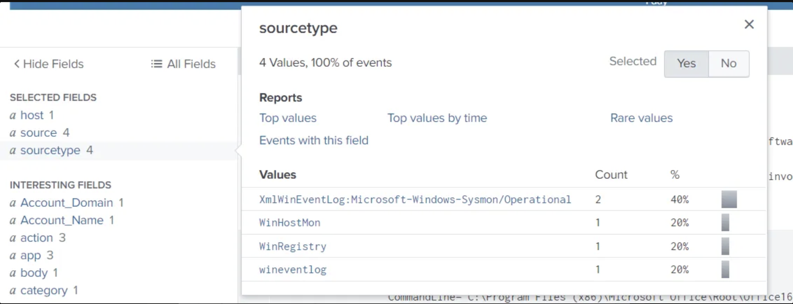

# Cyber Threat Hunting with Splunk – Part 2: Initial Access

## Summary
In this lesson we continue cyber threat hunting using Splunk and the **BOTS v2 dataset**.  
The prior exercise covered the **Reconnaissance** phase. This one focuses on **Initial Access**, specifically spear phishing.

## Objectives
1. Continued practical familiarization using Splunk.  
2. Analyze initial access of an emulated APT campaign dataset.  
3. Create hypotheses and hunt plans from threat intelligence reports.  
4. Identify indicators of compromise.  

## Scenario
Law enforcement warns of an ongoing spearphishing campaign in our industry sector.  
We must **develop a hypothesis, plan, and execute** a Splunk hunt.

### Threat Intelligence Report Excerpt
- Vector: **Zipped spearphishing attachments (T1566.001)**  
- Execution: **User Execution (T1204.002)**  
- Lures: **Financial docs (invoices, receipts, requisitions, etc.)**

### Available Source Types
To check sourcetypes in Splunk:

spl
index=botsv2

`| metadata type=sourcetypes index=botsv2`

### Key Sourcetypes

Two key sourcetypes:
	•	Sysmon logs
	•	SMTP (email)

### Hypothesis

Adversaries launched spearphishing in August, delivering malicious attachments.
At least one user executed the attachment.

Plan of Action
	1.	Review stream:smtp logs for August.
	2.	Pivot to Sysmon logs for process creation (Event ID 1).

Initial Query

Set time picker → August 2017

Our first query will be for smtp logs.

`index=botsv2 sourcetype=stream:smtp`

Scroll to the bottom and select “more fields.”

Field Selection

Splunk doesn’t auto-display all fields.
At minimum, select:
	`•	receiver
	•	sender
	•	src_ip
	•	subject
	•	attach_filename{}
	•	attach_type{}
	•	attach_size{}
	•	attach_content_md5_hash{}`

 

Suspicious Attachment
	`•	Double-click attach_filename{}
	 •	Suspicious file: Invoice.zip`

Filtered down to 4 events.

Query: [`email_fields_invoice_zip.spl`](./queries/splunk/email_fields_invoice_zip.spl)

Result:

•	Same sender, subject, filename, size, hash, type across all 4 emails.

 

OSINT (ipinfo.io): last hop = Microsoft mail server

 

Switch to Events → view headers.

We can see the contents of the email, including the header, by clicking the drop down at “content”.

Copy and paste the email header.

MX Toolbox: origin = 185.83.51.21

Message-ID

Unique identifier, logged by servers. Useful for tracking.

Received

Each hop logs IP, server, timestamp.

Sender Policy Framework (SPF)

Validates sending IP ↔ domain relationship.

DomainKeys Identified Mail (DKIM)

Digital signature validation.

ARC (Authenticated Record Chain)

Preserves auth results across intermediaries.

DMARC

Builds on SPF + DKIM with policies & reporting.

Return-Path

Specifies where bounces go.

Online Email Analyzers
	•	MX Toolbox (https://mxtoolbox.com/EmailHeaders.aspx)

•	Microsoft Analyzer (https://mha.azurewebsites.net/)

Analysis Tips
	•	Trace Received lines → origin server.
	•	Check consistency (Return-Path, From, Received).
	•	Verify timestamps, SPF, DKIM.
	•	Use IP lookups.
	•	Watch for spoofing, base64, odd formatting.

Back to Our Investigation

From OSINT (ipinfo.io)
Pivot: IP 185.83.51.21 → domain ymlp.com (email service).

We see the domain for that IP address is ymlp.com. We can use OSINT to discover that YMLP is an email sending service.

Unfortunately, this will not tell us much as far as attribution, since this service could be used by anybody.

Identical email content across 4 emails.

Pivot on Sender

Query: [`sender_pivot.spl`](./queries/splunk/sender_pivot.spl)

Result: same sender targeted recipients 13 days earlier.

Further analysis shows that the sender used the previously discovered email sending service in the first set of emails.

Suspicious text file + base64 in body.

Decoded in CyberChef → malware.

Based on our analysis above, this is what we currently know.

- Phishing was attempted twice.
    
    First attempt was unsuccessful.
    
    Second attempt delivery succeeded.
    
- Sender IP: 185.83.51.21
- Sender Name is Jim Smith <jsmith@urinalysis.com>
- Phishing targeted the same four recipients both times.
- Subject: Invoice
- Body was identical
- Emails were sent in close proximity, but individually
- Attachment was the same for each recipient.

Below is a graphical representation of what we currently know.

User Execution

To confirm whether any of the four targeted users executed the phishing attachment, we focus on activity from 23 August, the date of the attack. Running a query without specifying a sourcetype helps reveal which log sources reference invoice.zip. ⚠️ Note: in enterprise environments, avoid broad queries without sourcetype filters unless the timeframe is tightly constrained, to maintain efficiency.

Query: [`broad_invoice_zip_no_sourcetype.spl`](./queries/splunk/broad_invoice_zip_no_sourcetype.spl) 

All logs tie to host wrk-btun (Billy Tun).

From registry: WINWORD opened invoice.doc from extracted zip.

Query: [`sysmon_invoice_zip_table.spl`](./queries/splunk/sysmon_invoice_zip_table.spl)

We can dig deeper by changing the time picker to the time of the first Sysmon event.

Drill into timeline: [`host_reverse_timeline.spl`](./queries/splunk/host_reverse_timeline.spl)  

Find base64-encoded PowerShell.

Decoded → malicious script.

Key Actions by Script:
	•	Disable AMSI
	•	Ignore SSL validation
	•	Create WebClient
	•	Set user-agent + cookies
	•	Contact C2 → 45.77.65.211
	•	Download, decrypt, execute payload

Conclusion

Findings:
	•	Two phishing waves (1 failed, 1 delivered).
	•	Same sender: Jim Smith <jsmith@urinalysis.com>
	•	IPs: 185.83.51.21, 45.77.65.211
	•	Targeted same 4 users.
	•	Execution confirmed on host wrk-btun (Billy Tun).
	•	Dropped malicious PowerShell → outbound C2.

 

References
	•	Dataset: Splunk BOTS v2 (https://bots.splunk.com/)
	•	Tools: MX Toolbox, CyberChef, ipinfo.io    
